# WCS_Brain v9.3.1 🧠✨ [Ultimate God-Tier UI Edition]

**Addon Core de Hermandad Exclusivo de "El Séquito del Terror"** 💀⚔�

Addon modular avanzado para Turtle WoW (1.12) que implementa un sistema de IA ultra-inteligente, soporte **Multi-Clase (9 clases)**, gestión avanzada de recursos, aprendizaje automático y un Hub de Comando unificado.

## 🚀 Última Actualización v9.3.1 [Pet AI Fix - Marzo 2026]
**Estado:** ✅ OPERATIVO — IA de Mascotas 100% Funcional (ES + EN)
- **Pet AI Reparada**: Corrección de capitalización de 15+ habilidades de mascota (Sentence Case para cliente español).
- **Motor de Macros Restaurado**: Sistema de casteo via `/cast` (inmune a slots de barra), con doble gatillo ES/EN.
- **Paridad con Backup**: Comportamiento idéntico a la versión estable con restauración de target en 0.8s.

## 🚀 REARQUITECTURA MAYOR v9.3.0 [God-Tier Upgrade]
**Estado:** ✅ OPERATIVO - Compatibilidad Multi-Clase y Deep Void UX
**v8 Integration:** Todo el sistema Predictivo y Holográfico ha sido reescrito para soportar **TODAS las clases** del juego (Warriors, Mages, Priests, Rogues, Hunters, Shamans, Druids, Paladins, Warlocks) con motores heurísticos dedicados.

La versión 9.3 representa la evolución definitiva. Hemos consolidado el ecosistema fragmentado en un **Hub de Control de 5 Pestañas** y expandido el cerebro a todo el clan.

### � Séquito Ecosystem Compatible (SquadMind)
Este addon es el **Vínculo Maestro** de la Red Neural de 10 addons del clan. 

```mermaid
graph TD
    classDef core fill:#2C0000,stroke:#FF0000,stroke-width:2px,color:#fff;
    classDef intel fill:#003366,stroke:#00BFFF,stroke-width:2px,color:#fff;
    WCS["🔮 WCS_Brain<br/>(Vínculo Maestro)"]:::core
    TSAI["🧠 TerrorSquadAI<br/>(Comandante Táctico)"]:::core
    DT["�� DoTimer<br/>(Reloj Biológico)"]:::intel
    AUX["💰 aux-addon<br/>(Mercado)"]:::intel
    
    WCS <==>|Telemetría de Combate y Sugerencias| TSAI
    DT ==>|Avisa de Debuffs faltantes| WCS
    AUX -.->|Sincronización del Banco Clan| WCS
```



- **Simbiosis con TerrorSquadAI**: Envía sugerencias de IA calculadas localmente para que TSAI tome decisiones a nivel banda.
- **Simbiosis con DoTimer**: Automatiza la rotación de Curses (Maldiciones) de Warlock detectando faltantes en el objetivo.
- **Simbiosis con Aux**: Lee la base de precios del AH para valorar los bienes guardados en el `WCS_ClanBank`.

### ✨ Características Principales

#### 1. WCS_ClassEngine: El Motor Universal
La IA ya no es exclusiva de Warlocks. Identifica automáticamente tu clase al conectar.
- **DPS Predictivo:** Lee los tooltips de tus hechizos, aplica modificadores de talentos, gear y buffs, y calcula el daño exacto por segundo de casteo (DPCT).
- **Snapshotting:** Si se activa un abalorio de daño o te dan Power Infusion, la IA lo detecta al instante y ajusta la rotación para aprovechar el burst.

#### 2. WCS_BrainHUD: Interfaz Holográfica
Siéntete como Iron Man con una nueva UI flotante y minimalista.
- **Visualización Anticipada:** Un icono flota cerca de tu personaje mostrándote qué hechizo va a lanzar la IA *antes* de que lo haga.
- **Monitor de Recursos:** Un anillo holográfico te indica cuántas Soul Shards tienes sin tener que mirar tus bolsas.
- **Comando:** `/brainhud`

#### 3. Arquitectura de Eventos (Rendimiento Extremo)
- **WCS_EventManager:** Nuevo núcleo que gestiona todos los eventos del juego de forma centralizada.
- **WCS_ResourceManager:** Gestor inteligente que trackea tus items (Healthstones, Soulstones, Shards) sin escanear el inventario constantemente.
- **Resultado:** Menor uso de CPU y mayor FPS en raids de 40 personas.

---


## � Sistema de Control de Mascotas v8.0.0 [God-Tier Upgrade]
**Estado:** ✅ MEJORADO - Confiabilidad 99%
**v8 Integration:** Sincronización nativa con el PetManager v8 para micro-gestión de combate.

**¿Qué cambió?**
El sistema de control de mascotas ha sido completamente reescrito para mejorar drásticamente su confiabilidad. Antes usaba ChatFrameEditBox como método principal (60% confiable), ahora usa CastSpellByName() con múltiples fallbacks (95% confiable).

**Nuevas Funciones:**
- **GetPetAbilitySlot()** - Encuentra habilidades en la barra de mascotas
- **PetHasAbility()** - Verifica si la mascota tiene una habilidad
- **CanCastPetAbility()** - Verificación completa: existencia + CD + mana

**Mejoras Principales:**
- ✅ ExecuteAbility() con 3 métodos de ejecución (CastSpellByName → CastPetAction → ChatFrameEditBox)
- ✅ Cooldowns usando API real (GetPetActionCooldown) en lugar de timers manuales
- ✅ Modo Guardián mejorado con feedback visual y HP del protegido
- ✅ Debug detallado: "[Execute] Fire Shield - CastSpellByName"
- ✅ Compatible con todas las mascotas (Imp, Voidwalker, Succubus, Felhunter, Felguard)

**Comandos:**
```lua
/petai debug        -- Activa debug detallado
/petai status       -- Muestra versión (v8.0.0)
```

**Documentación completa:** Ver CHANGELOG.md


---


## � Sistema Multiidioma v8.0.0 [God-Tier Upgrade]
**Estado:** ✅ OPERATIVO - Traducción Instantánea
**v8 Integration:** Motor de localización cargado bajo demanda para ahorro de memoria.

**Nuevos Módulos:**
- **WCS_SpellLocalization.lua** - Base de datos de 150+ traducciones español→inglés
- **WCS_SpellDB_Patch.lua** - Sobrescritura global de GetSpellName()
- **WCS_BrainAutoExecute.lua** - Sistema de ejecución automática en combate

**Características:**
- ✅ Funciona en clientes en español sin modificar archivos originales
- ✅ Sobrescritura global transparente de GetSpellName()
- ✅ 150+ hechizos del Brujo traducidos (todos los críticos)
- ✅ Habilidades de todas las mascotas incluidas
- ✅ Sistema de cache para eficiencia
- ✅ Compatible con actualizaciones futuras del addon

**Comandos:**
```lua
/listspells            -- Ver todos los hechizos y su estado de traducción
                       -- VERDE = traducido, ROJO = sin traducir
/autoexec on/off       -- Activar/desactivar ejecución automática
/autoexec status       -- Ver estado del sistema
/autoexec interval <s> -- Cambiar intervalo (0.1-2.0s)
```

**Hechizos Verificados:**
- ✅ Armadura Demoníaca, Inmolar, Llamas Infernales, Lluvia de Fuego
- ✅ Quemadura de las Sombras, Piedras de Alma/Salud (todos los rangos)
- ✅ Todas las habilidades de mascotas (Imp, Voidwalker, Succubus, Felhunter, Felguard)

**Documentación completa:** Ver MULTIIDIOMA.md

---

## 🧠 Sistema de Aprendizaje v8.0.0 [God-Tier Upgrade]
**Estado:** ✅ OPERATIVO - Red Neuronal Activa
**v8 Integration:** Integrado con el Dashboard v8 para visualización de métricas DQN.

**Nuevo Módulo:** WCS_BrainCombatLogger.lua - Sistema de captura de eventos de combate

**Comandos:**
```lua
/brainlearn status      -- Ver estado del sistema
/brainlearn debug       -- Ver hechizos capturados y combates
/brainlearn patterns    -- Ver patrones aprendidos
/combatlogger status    -- Ver estado del logger
/combatlogger debug     -- Activar modo debug
```

**Cómo funciona:**
1. El sistema captura automáticamente todos los hechizos que usas en combate
2. Registra daño, casts, uso de mana
3. Después de 10+ combates, empieza a generar patrones de aprendizaje
4. Los patrones mejoran la IA para sugerir mejores rotaciones

**Ejemplo de captura:**
```
Combates: 4/10
Hechizos capturados:
  * Death Coil: 4 casts, 544 dmg
  * Immolate: 4 casts, 336 dmg
  * Hellfire Effect: 13 casts, 2946 dmg
```

**Documentación completa:** Ver SISTEMA_APRENDIZAJE.md

---

## 🆕 Novedades v8.0.0 (Enero 2026)

### 🔔 Sistema de Notificaciones de Warlock

**WCS_BrainWarlockNotifications** - Sistema inteligente de alertas para Warlocks

**Características:**
- ✅ Detección automática de buffs (Demon Armor, Soul Link)
- ✅ Alertas de Soul Shards bajos (crítico: ≤1, bajo: ≤3)
- ✅ Notificaciones de Healthstone disponible
- ✅ Alertas al entrar en combate sin preparación
- ✅ Sistema anti-spam con throttling
- ✅ 3 tipos de notificaciones visuales (Info, Warning, Critical)
- ✅ Sonidos diferenciados por tipo de alerta

**Comandos:**
```lua
/wcswarlock status     -- Ver estado completo (Soul Shards, buffs, etc.)
/wcswarlock test       -- Probar notificaciones visuales
/wcswarlock toggle     -- Activar/desactivar notificaciones
/wcslock              -- Alias corto (equivalente a /wcswarlock)
```

**Notificaciones Automáticas:**
- ⚠� **Demon Armor**: Avisa si no lo tienes activo
- 🚨 **Soul Shards Crítico**: Avisa si tienes ≤1 Soul Shard
- ⚠� **Soul Shards Bajos**: Avisa si tienes ≤3 Soul Shards
- ℹ� **Healthstone Disponible**: Avisa si puedes crear uno
- ⚠� **Combate**: Avisa si entras en combate sin Demon Armor, Soul Shards o Healthstone

**Tipos de Notificaciones:**
1. **INFO** (Blanco) - Información general, sin sonido
2. **WARNING** (Amarillo) - Advertencias importantes, sonido de raid
3. **CRITICAL** (Magenta) - Situaciones críticas, sonido de boss

**💡 Qué son los Soul Shards:**
Los Soul Shards son fragmentos de alma que obtienes con **Drain Soul** al matar enemigos. Son necesarios para:
- Invocar demonios (1 shard)
- Crear Healthstones (1 shard)
- Crear Soulstones (1 shard)
- Soul Fire (1 shard)
- Ritual of Summoning (1 shard)

**Recomendación:** Mantén siempre 10-15 Soul Shards para tener suficientes recursos.

---

### 📢 Sistema de Notificaciones en Pantalla

**WCS_BrainNotifications** - Sistema base de notificaciones visuales

**Características:**
- ✅ Notificaciones en centro de pantalla (UIErrorsFrame)
- ✅ 5 tipos: INFO, SUCCESS, WARNING, ERROR, CRITICAL
- ✅ Sistema anti-spam (throttling de 2 segundos)
- ✅ Historial de notificaciones
- ✅ Sonidos configurables por tipo
- ✅ Fallback a chat si UIErrorsFrame no disponible

**Comandos:**
```lua
/wcsnotif              -- Ver estado del sistema
/wcsnotif toggle       -- Activar/desactivar
/wcsnotif test         -- Probar todos los tipos
/wcsnotif clear        -- Limpiar historial
```

---

### �� Sistema de Throttling de Eventos

**WCS_BrainEventThrottle** - Optimización de eventos de combate

**Características:**
- ✅ Limita frecuencia de eventos de combate
- ✅ Previene sobrecarga del sistema
- ✅ Intervalos configurables por tipo de evento
- ✅ Estadísticas de eventos procesados/descartados

**Comandos:**
```lua
/wcsthrottle           -- Ver configuración actual
/wcsthrottle stats     -- Ver estadísticas
/wcsthrottle reset     -- Resetear contadores
```

---

### 🛡� Sistema de Seguridad

**WCS_BrainSafety** - Límites de seguridad para prevenir errores

**Características:**
- ✅ Límites de iteraciones en loops
- ✅ Protección contra loops infinitos
- ✅ Validación de parámetros
- ✅ Sistema de circuit breaker

**Comandos:**
```lua
/wcssafety             -- Ver límites actuales
/wcssafety reset       -- Resetear contadores
```

---

### ✅ Validador de Datos Guardados

**WCS_BrainSavedVarsValidator** - Validación de SavedVariables

**Características:**
- ✅ Valida estructura de datos guardados
- ✅ Repara datos corruptos automáticamente
- ✅ Backup de datos antes de reparar
- ✅ Reporte de problemas encontrados

**Comandos:**
```lua
/wcsvalidate           -- Validar datos guardados
/wcsvalidate repair    -- Reparar datos corruptos
/wcsvalidate backup    -- Crear backup manual
```

---

### 📊 Dashboard de Rendimiento

**WCS_BrainDashboard** - Panel de control de rendimiento

**Características:**
- ✅ Visualización de métricas en tiempo real
- ✅ Gráficos de DPS, TPS, HPS
- ✅ Estadísticas de IA (decisiones, aciertos)
- ✅ Uso de memoria y CPU
- ✅ Eventos procesados

**Comandos:**
```lua
/wcsdash               -- Abrir dashboard
/wcsdash mini          -- Modo compacto
/wcsdash reset         -- Resetear estadísticas
```

---

### 🔥 Integración con WeakAuras

**WCS_BrainWeakAuras** - Exporta datos para WeakAuras

**Características:**
- ✅ Exporta estado de IA
- ✅ Exporta cooldowns importantes
- ✅ Exporta sugerencias de hechizos
- ✅ Compatible con WeakAuras 2

**Comandos:**
```lua
/wcswa                 -- Ver estado de integración
/wcswa export          -- Exportar datos
```

---

### 💀 Integración con Boss Mods

**WCS_BrainBossMods** - Integración con BigWigs/DBM

**Características:**
- ✅ Detecta alertas de boss mods
- ✅ Ajusta estrategia según fase de boss
- ✅ Prioriza interrupciones en momentos críticos
- ✅ Compatible con BigWigs y DBM

**Comandos:**
```lua
/wcsbm                 -- Ver estado de integración
/wcsbm toggle          -- Activar/desactivar
```

---

### 🧹 Sistema de Limpieza Automática

**WCS_BrainCleanup** - Limpieza de cooldowns y datos obsoletos

**Características:**
- ✅ Limpieza automática de cooldowns expirados
- ✅ Limpieza de datos de combate antiguos
- ✅ Optimización de memoria
- ✅ Ejecución periódica automática

**WCS_BrainPetAICleanup** - Limpieza específica de mascota

**Características:**
- ✅ Limpieza de cooldowns de habilidades de mascota
- ✅ Limpieza de datos de comportamiento
- ✅ Optimización de memoria de PetAI

---

## 🆕 Novedades v8.0.0 (Enero 2026)

### � Sistema Guardian para Mascotas - Protección de Aliados

**¿Qué es el Sistema Guardian?**
Permite que tu mascota proteja automáticamente a un aliado asignado, detectándolo cuando es atacado y quitando aggro de los enemigos.

**Activación:**
1. Targetea al aliado que quieres proteger
2. Haz clic derecho en la barra de la pet
3. La pet entra en modo Guardian automáticamente

**Características:**
- ✅ Detección automática de atacantes en tiempo real (CombatLog)
- ✅ Priorización del atacante más peligroso (mayor DPS)
- ✅ Rotación inteligente de habilidades por mascota:
  - **Voidwalker**: Torment (taunt) + Suffering (AoE taunt)
  - **Felguard**: Anguish (taunt AoE) + Cleave
  - **Succubus**: Seduction (CC para quitar aggro)
  - **Felhunter**: Spell Lock (interrupt) + Devour Magic
  - **Imp**: Fire Shield automático al aliado
- ✅ Alertas visuales cuando protege al aliado (5 tipos)
- ✅ Tracking de estadísticas: DPS recibido, daño total, lista de atacantes
- ✅ NO targetea enemigos muertos
- ✅ NO cambia tu target durante combate

**Comandos:**
```lua
/petguard [nombre]     -- Asignar guardián manualmente
/petguard target       -- Asignar tu target actual
/gstats                -- Ver estadísticas detalladas
/galerts on/off        -- Activar/desactivar alertas
/guardmacros create    -- Crear macros WCS_Guard y WCS_PetPos
```

**Macros Creadas:**
- **WCS_Guard**: Asigna guardián a tu target actual
- **WCS_PetPos**: Posiciona manualmente la pet (Pet Command: Take Position)

**Limitaciones:**
- ⚠� El aliado DEBE estar en tu party/raid para detectar ataques
- ⚠� En WoW 1.12, la pet no puede seguir automáticamente a aliados (solo al jugador)

---

### 🔥 Alertas Mejoradas de Demonios Mayores

**Problema resuelto:** Las alertas de Infernal/Doomguard eran poco visibles.

**Mejoras:**
- ✅ Frame visual grande (400x80px) en centro superior
- ✅ Sistema de 3 alertas progresivas:
  - 60s restantes: Alerta amarilla + sonido RaidWarning
  - 30s restantes: Alerta naranja + sonido RaidWarning
  - 15s restantes: Alerta roja parpadeante + sonido AlarmClockWarning3
- ✅ Mensajes en centro de pantalla (UIErrorsFrame)
- ✅ Funciona para AMBOS demonios (Infernal y Doomguard)

**Comandos:**
```lua
/mdalerts on/off       -- Activar/desactivar alertas
/mdalerts test         -- Probar alerta (muestra Infernal 15s crítico)
/md status             -- Ver estado del demonio actual
```

---

## 🆕 Novedades v8.0.0 (Enero 2026)

### 🧹 Limpieza y Optimización de Código

**Archivos Obsoletos Removidos:**
- ✅ Eliminados 6 archivos HotFix obsoletos (v8.0.0, v8.0.0, v8.0.0, v8.0.0)
- ✅ Correcciones ya integradas en código base
- ✅ WCS_Brain.toc limpio sin referencias obsoletas
- ✅ Backup completo en carpeta `backup_obsolete/`

**Mejoras de Mantenibilidad:**
- Código más limpio y fácil de mantener
- Reducción de archivos innecesarios
- Mejor organización del proyecto

### ⚔� Sistema de Combate Integrado - Arbitraje Unificado

**Problema Resuelto**: Los tres sistemas de IA (DQN, SmartAI, Heuristic) operaban independientemente causando decisiones conflictivas.

**Nuevos Módulos:**

#### 1�⃣ **WCS_BrainCombatController** - Controlador Central
- ✅ Arbitraje unificado entre DQN, SmartAI y Heuristic
- ✅ 4 modos de operación: `dqn_only`, `smartai_only`, `heuristic_only`, `hybrid`
- ✅ Sistema de prioridades con decisiones de emergencia
- ✅ Pesos configurables para modo híbrido
- ✅ Throttling de decisiones (0.1s mínimo)
- ✅ Historial de últimas 50 decisiones

#### 2�⃣ **WCS_BrainCombatCache** - Cache Compartido
- ✅ Cache centralizado de DoTs con tracking temporal
- ✅ Sistema de amenaza (threat) compartido
- ✅ Detección de Pandemic Window (30% duración)
- ✅ Sincronización automática con WCS_BrainAI
- ✅ Limpieza periódica de datos obsoletos

#### 3�⃣ **Coordinación con PetAI**
- ✅ Hook `OnPlayerAction()` para sincronización jugador-mascota
- ✅ Detección de acciones clave: Fear, Death Coil, Health Funnel
- ✅ Comunicación bidireccional

**Comandos Nuevos:**
```lua
/wcscombat mode [dqn_only|smartai_only|heuristic_only|hybrid]
/wcscombat weights <dqn> <smartai> <heuristic>  -- Ej: 0.4 0.4 0.2
/wcscombat status
/wcscombat reset
```

**Configuración Recomendada (Híbrido):**
```lua
/wcscombat mode hybrid
/wcscombat weights 0.4 0.4 0.2
```

**Mejoras de Rendimiento:**
- Eliminación de cálculos duplicados entre sistemas
- Decisiones coherentes y unificadas
- Cache compartido optimiza consultas de estado

---

## 🆕 Novedades v8.0.0 (Enero 2026)

### �� UI del Clan - Sistema Completo de Gestión

**7 Módulos UI Implementados:**

#### 1�⃣ **WCS_ClanPanel** - Panel Principal del Clan
- ✅ Lista de miembros del guild en tiempo real
- ✅ Colores por clase y estado online/offline
- ✅ Scroll frame funcional para 100+ miembros
- ✅ Actualización automática con eventos de guild

#### 2�⃣ **WCS_ClanBank** - Banco del Clan
- ✅ Sistema de tracking de oro (depósitos/retiros)
- ✅ Inventario compartido de items
- ✅ Sistema de préstamos con tracking
- ✅ Lista de crafters y materiales
- ✅ **Persistencia de datos** (SavedVariables)
- ✅ **Sincronización en raid/party** (Addon Communication)

#### 3�⃣ **WCS_RaidManager** - Gestión de Raid
- ✅ **Detección REAL de buffs** (Healthstone/Soulstone)
- ✅ Distribución de Healthstones con detección de inventario
- ✅ Asignación de Soulstones con sistema de prioridades
- ✅ Auto-asignación de Curses a warlocks
- ✅ **Auto-whisper** a miembros sin HS/SS
- ✅ **Anuncios en raid chat** de asignaciones
- ✅ **3 macros automáticas** (HS, SS, Curses)

#### 4�⃣ **WCS_SummonPanel** - Sistema de Invocaciones
- ✅ Cola de summon con prioridades (Tank > Healer > DPS)
- ✅ Sistema de turnos automático
- ✅ **Auto-whisper** en cola y turnos
- ✅ **Macro automática** de Ritual of Summoning

#### 5�⃣ **WCS_Statistics** - Estadísticas de Combate
- ✅ Tracking de DPS en tiempo real
- ✅ Breakdown de DoT damage
- ✅ Contador de consumibles usados
- ✅ **Anuncios en raid** de DPS y stats

#### 6�⃣ **WCS_Grimoire** - Grimorio del Warlock
- ✅ Rotaciones predefinidas por spec
- ✅ Macros útiles
- ✅ Guía de BiS gear
- ✅ Calculadora de stats

#### 7�⃣ **WCS_PvPTracker** - Tracking de PvP
- ✅ Contador de kills/deaths
- ✅ Sistema de llamadas de objetivos
- ✅ Escaneo de área para enemigos
- ✅ **3 macros PvP** (Fear, Death Coil, Howl of Terror)

---

### ✨ 6 Mejoras de Funcionalidad REAL Implementadas

#### ✅ 1. SavedVariables - Persistencia de Datos
- Datos del banco persisten entre sesiones
- LoadData() y SaveData() automáticos
- Declarado en .toc: WCS_BankData, WCS_PvPTrackerData, WCS_RaidManagerData

#### ✅ 2. Detección de Buffs en Raid
- UnitBuff() escanea 40 miembros del raid
- Detecta REALMENTE quién tiene Healthstone/Soulstone
- Actualización automática cada 2 segundos

#### ✅ 3. Macros Automáticas
- CreateMacro() y EditMacro() - APIs reales de WoW
- 7 macros creadas automáticamente:
  - WCS_HS (usar healthstone)
  - WCS_SS (crear soulstone)
  - WCS_Curse (curses con modificadores)
  - WCS_Summon (ritual of summoning)
  - WCS_Fear, WCS_Coil, WCS_Howl (PvP con mouseover)

#### ✅ 4. Auto-Whisper a Miembros
- SendChatMessage() envía whispers REALES
- Notifica quién necesita healthstone
- Notifica asignaciones de soulstone
- Notifica posición en cola de summon

#### ✅ 5. Addon Communication (Sync)
- SendAddonMessage() sincroniza datos en raid/party
- Prefix: WCS_BRAIN
- Sincroniza datos del banco entre jugadores
- Botones: "Sincronizar" y "Solicitar Sync"

#### ✅ 6. Anuncios en Raid Chat
- SendChatMessage("texto", "RAID") funciona
- Anuncia asignación de curses
- Anuncia DPS al final de combate
- Anuncia breakdown de DoTs

---

### 📊 Estadísticas del Proyecto

**Código:**
- ~2,214 líneas de código revisadas
- 110+ funciones implementadas
- 21 botones en total
- 0 errores encontrados

**Funcionalidad:**
- 7 módulos UI completos
- 6 mejoras de funcionalidad REAL
- 100% compatible con WoW 1.12 (Lua 5.0)

**Comandos del Clan UI:**
- `/clan` - Abrir panel principal
- `/clanbank` - Abrir banco
- `/raidmanager` - Abrir gestión de raid
- `/summonpanel` - Abrir panel de summon
- `/warlockstats` - Abrir estadísticas

---

## 🆕 Novedades v8.0.0 (Diciembre 2025)

### 💊 Pestaña Recursos - 100% Funcional

**Healthstones:**
- ✅ Detección automática de healthstones en inventario (todos los tipos)
- ✅ Contador en tiempo real con colores dinámicos (rojo/amarillo/verde)
- ✅ Botón "Distribuir HS" con validaciones y mensajes

**Soulstones:**
- ✅ Detección automática de soulstones en inventario
- ✅ Lista en tiempo real de miembros con SS activo
- ✅ Botón "Asignar SS" con detección de buffs en raid/grupo
- ✅ Actualización automática con eventos UNIT_AURA

**Ritual of Summoning:**
- ✅ Detección de portal de invocación activo
- ✅ Cooldown del hechizo en tiempo real
- ✅ Botón "Iniciar Ritual" que lanza el hechizo automáticamente
- ✅ Estados visuales: Portal Activo / Listo / CD / No aprendido

**Nivel de funcionalidad:** 40% → 100% ✅

---

## 🆕 Novedades v8.0.0 (Diciembre 2025)

### � 11 Módulos Nuevos - Sistema Expandido

#### � WCS_BrainLogger - Sistema de Logging Profesional
- 5 niveles de log: DEBUG, INFO, WARN, ERROR, CRITICAL
- Historial de 100 entradas con timestamps
- Filtrado por nivel y módulo
- Comandos: `/brainlog`, `/brainlog clear`, `/brainlog level [nivel]`

#### âš¡ WCS_BrainCache - Sistema de Cache Inteligente
- Cache con TTL (Time To Live) configurable
- Auto-limpieza de entradas expiradas
- Estadísticas de hit/miss
- Comandos: `/braincache`, `/braincache clear`, `/braincache stats`

#### � WCS_BrainLocale - Soporte Multi-Idioma
- 5 idiomas: Inglés, Español, Portugués, Francés, Alemán
- 50+ strings traducidas
- Cambio dinámico de idioma
- Comandos: `/brainlang [en|es|pt|fr|de]`

#### 🧠 WCS_BrainMemory - Sistema de Memoria de Mobs
- Recuerda hasta 500 mobs diferentes
- Tracking de encuentros, kills, deaths
- Cálculo de dificultad por mob
- Integrado con WCS_BrainMetrics
- Comandos: `/brainmemory`, `/brainmemory [nombre_mob]`

#### � WCS_BrainMacros - Generación Automática de Macros
- Genera macros basadas en tus estadísticas
- Top 5 hechizos por DPS
- Actualización automática
- Macro por defecto si no hay datos
- Comandos: `/brainmacro show`, `/brainmacro generate`

#### ⚔� WCS_BrainPvP - Modo PvP Inteligente
- Detección automática de jugadores enemigos
- Estrategias específicas por clase (9 clases)
- Priorización de objetivos
- Comandos: `/brainpvp`, `/brainpvp on/off`

#### � WCS_BrainPetChat - Chat de Mascotas con Personalidad
- 4 personalidades únicas: Agresivo, Tímido, Juguetón, Sabio
- Diálogos contextuales (invocación, combate, victoria, muerte)
- Mensajes aleatorios
- Comandos: `/brainpetchat`, `/brainpetchat personality [tipo]`

#### � WCS_BrainAchievements - Sistema de Logros
- 9 logros desbloqueables:
  - First Blood (primera kill)
  - Gladiador (100 kills)
  - Survivor (sobrevivir con <5% HP)
  - Efficient Killer (80%+ win rate, 100 combates)
  - Speed Demon (kill en <10s)
  - Mana Master (50 combates sin quedarse sin mana)
  - Pet Master (usar 4 mascotas diferentes)
  - Brain Trust (100 sugerencias del Brain)
  - Learning Machine (1000 combates registrados)
- Tracking automático
- Notificaciones de desbloqueo
- Comandos: `/brainachievements`

#### 📚 WCS_BrainTutorial - Tutorial Interactivo
- 11 pasos guiados para aprender el addon
- Comandos explicados: `/wcs cast`, `/brain`, `/smartai`, etc.
- Progreso guardado
- Comandos: `/braintutorial start`, `/braintutorial next`

#### 🖼� WCS_BrainTutorialUI - Interfaz Gráfica del Tutorial
- Ventana visual de 450x300 píxeles
- Movible arrastrando
- Barra de progreso visual
- Botones: Anterior, Siguiente, Cerrar
- Comandos: `/tutorialui show/hide`

#### 🔘 WCS_BrainTutorialButton - Botón Flotante
- Botón pequeño de 40x40 píxeles con icono de libro
- Click: Abrir/continuar tutorial
- Shift+Click: Reiniciar tutorial
- Arrastrable a cualquier posición
- Guarda posición automáticamente
- Comandos: `/tutorialbutton`, `/tutbtn`

#### 📈 WCS_BrainTerrorMeter - Integración con TerrorMeter
- Detección automática del addon TerrorMeter
- Lectura de DPS/HPS en tiempo real
- Sistema de ranking en grupo/raid
- Top hechizos por daño
- Estadísticas históricas (peak DPS, promedio, veces #1)
- Sistema de bonus dinámico basado en DPS real
- 3 nuevos logros de rendimiento:
  - � Top DPS (alcanza #1 en DPS)
  - 🔥 DPS Master (promedio >500 DPS)
  - â­� Consistent DPS (10 veces #1)
- Actualización periódica cada 1 segundo
- Compatible con Lua 5.0
- Comandos: `/btm`, `/brainterror`

#### 🔗 WCS_BrainIntegrations - Sistema de Integración con Addons
- **Detección automática** de 40+ addons populares de Turtle WoW
- **7 categorías de addons**:
  - 📊 Damage Meters: Recount, DamageMeters, SW_Stats, Recap, TinyDPS, TerrorMeter
  - ⚠� Threat Meters: KTM, KLHThreatMeter, Omen, ThreatMeter, ClassicThreatMeter
  - 💀 Boss Mods: BigWigs, CTRaidAssist, CTRA, BossWarnings, RaidAlert
  - 🖼� Unit Frames: DiscordUnitFrames, ag_UnitFrames, Perl, XPerl, PitBull
  - �� Casting Bars: Quartz, eCastingBar, CastingBarMod, ImprovedCastBar
  - � Bag Addons: Bagnon, OneBag, ArkInventory, Enginventory, BagBrother
  - 💰 Auction House: Auctioneer, aux-addon, BeanCounter, AuctionMaster
  - 📜 Quest Helpers: Questie, ShaguQuest, QuestHelper, MonkeyQuest, QuestLog
  - � Action Bars: Bartender, Bongos, CT_BarMod, Discord_ActionBars, FlexBar
  - ✨ Buff/Debuff: Buffalo, Buffwatch, ClassicAuraDurations, DebuffTimers
  - 💥 Combat Text: SCT, MSBT, Parrot, CombatText, xCT
  - � Cooldown Trackers: OmniCC, CooldownCount, ClassicCastbars, CooldownTimers
- **Verificación inteligente**: Múltiples métodos de detección (variables globales, funciones específicas)
- **Resumen de detección**: Muestra todos los addons detectados al cargar
- **Compatible con Lua 5.0**: Optimizado para Turtle WoW (1.12)
- **Comandos**: Los addons se detectan automáticamente al cargar WCS_Brain

---

## 🆕 Novedades v8.0.0 (Diciembre 2025)

### � Sistema de Mascotas Inteligente (PetAI + PetUI)
- **Botón PetUI mejorado**: Interfaz visual con indicador de IA y stats de mascota
- **3 Modos de IA**: Agresivo (rojo), Defensivo (verde), Soporte (cyan)
- **Click derecho**: Cambiar modo de IA instantáneamente
- **Shift+Click**: Alternar modo compacto/expandido
- **Notificaciones visuales**: Flash en daño, curación, muerte
- **Indicador de buffs**: Hasta 4 iconos alrededor del botón
- **Barra de felicidad**: Solo para Hunters
- **Tooltip mejorado**: Información completa de mascota y modo
- **Comportamiento real**: Cada modo afecta qué habilidades usa la mascota
- **Comandos**: `/petai status`, `/petai debug`, `/petai on/off`

**Mascotas soportadas:**
- Warlock: Imp, Voidwalker, Succubus, Felhunter, Felguard, Infernal, Doomguard
- Hunter: Todas las mascotas (con barra de felicidad)
- Auto-reenslave para demonios esclavizados

### 🧠 SmartAI System - IA Ultra-Inteligente
- **Predicción de TTK**: Calcula tiempo hasta muerte del objetivo
- **Gestión inteligente de mana**: Ajusta uso según contexto (solo/grupo/raid)
- **Análisis de amenaza**: Rastrea amenaza en tiempo real
- **Optimización de DoTs**: Decide si aplicar DoTs según duración de combate
- **Scoring avanzado**: Evalúa hechizos con múltiples factores
- **Detección de patrones**: Aprende de encuentros previos
- **Comandos**: `/smartai debug`, `/smartai stats`

### � Sistema de Amenaza Completo
- Tracking automático por eventos de combate
- 60+ hechizos con modificadores específicos
- Multiplicadores por stance/forma
- Reset automático al salir de combate

---

## 🗺� Diagrama de Arquitectura v8.0.0

```
┌─────────────────────────────────────────────────────────────────────�
│                    � JUGADOR / WOW                               │
│               (Eventos, Combate, Comandos)                        │
└──────────────────────────────────┬──────────────────────────────────┘
                                 │
                                 â–¼
┌─────────────────────────────────────────────────────────────────────�
│          ⚔� WCS_BrainCombatController (v8.0.0)                  │
│              (Coordinador Central de Combate)                     │
│                                                                   │
│  Modos: hybrid | dqn_only | smartai_only | heuristic_only        │
└─────────────────────────────────┬────────────────────────────────────┘
                                 │
                    ┌────────────┴────────────�
                    │  Sistema de Emergencia  │
                    │  (Prioridad Máxima)     │
                    │  • HP < 15%             │
                    │  • Mana < 5%            │
                    │  • Pet < 10%            │
                    └────────────┬────────────┘
                                 │
                ┌────────────────┴────────────────�
                │                                 │
                â–¼                                 â–¼
┌───────────────────────────────�   ┌───────────────────────────────�
│ 💾 WCS_BrainCombatCache      │   │ � WCS_BrainPetAI            │
│ (Cache Compartido)            │   │ (Control de Mascota)          │
│                               │   │                               │
│ • DoTs tracking               │   │ • Coordinación con jugador   │
│ • Threat tracking             │   │ • OnPlayerAction() hook      │
│ • Pandemic window (30%)       │   │ • Adaptación de comportamiento│
│ • Cooldowns                   │   └───────────────────────────────┘
└───────────────────────────────┘
                │
                │ (Datos compartidos)
                │
    ┌───────────┴───────────┬───────────────�
    │                       │               │
    â–¼                       â–¼               â–¼
┌─────────────�   ┌──────────────────�   ┌─────────────────�
│ 🤖 DQN      │   │ 🧠 SmartAI       │   │ � Heuristic   │
│ (40%)       │   │ (40%)            │   │ (20%)           │
│             │   │                  │   │                 │
│ • Aprende   │   │ • TTK prediction │   │ • Reglas base  │
│ • Explora   │   │ • Threat análisis│   │ • Fallback     │
│ • Replay    │   │ • Mana gestión   │   │ • Simple       │
└─────────────┘   └──────────────────┘   └─────────────────┘
    │                       │               │
    └───────────┬───────────┴───────────────┘
                │
                â–¼
    ┌───────────────────────�
    │  Arbitraje Unificado  │
    │  Score = Prioridad ×  │
    │  Confianza × Peso     │
    └───────────┬───────────┘
                │
                â–¼
    ┌───────────────────────�
    │  ⚡ ACCIÓN EJECUTADA  │
    │   (CastSpellByName)   │
    └───────────────────────┘
```

### 📊 Flujo de Decisión v8.0.0

**Modo Híbrido (RECOMENDADO)**
```
Evento → CombatController → Emergencia? → Cache → [DQN + SmartAI + Heuristic]
                                                    ↓
                                            Arbitraje (Score)
                                                    ↓
                                                Ejecuta
```
✅ Mejor de 3 sistemas | ✅ Decisiones coherentes | ✅ Cache optimizado

**Modo DQN Only**
```
Evento → CombatController → Emergencia? → Cache → DQN → Ejecuta
```
✅ Aprendizaje puro | ✅ Mejora con tiempo

**Modo SmartAI Only**
```
Evento → CombatController → Emergencia? → Cache → SmartAI → Ejecuta
```
✅ Predecible | ✅ Análisis avanzado | ✅ Consistente

---

## ⚡ Uso Rápido

### Comandos
- `/wcs cast` - Activa BrainAI + SmartAI (recomendado)
- `/wcs dqn` - Activa DQN (aprendizaje)
- `/smartai debug` - Modo debug
- `/smartai stats` - Estadísticas
- `/brain on/off` - Activa/desactiva IA

### Macro Recomendada
```
/wcs cast
```

---

## 🚀 Características

### 🧠 SmartAI (v8.0.0)
- Predicción de TTK basada en DPS histórico
- Gestión contextual de mana (solo/grupo/raid)
- Análisis de amenaza en tiempo real
- Optimización de DoTs
- Scoring multi-factor
- Aprendizaje de patrones

### � Sistema de Amenaza
- 60+ hechizos con modificadores
- Multiplicadores por stance/forma
- Tracking automático
- Reset al salir de combate

### 🤖 Sistema DQN
- Red neuronal de aprendizaje
- Explora y explota
- Guarda modelo entrenado

---

## 📚 Archivos Principales

**Core:**
- `WCS_Brain.lua` - Núcleo
- `WCS_BrainAI.lua` - IA base

**SmartAI:**
- `WCS_BrainSmartAI.lua` - IA avanzada (1000+ líneas)
- `WCS_BrainSmartAI_Integration.lua` - Hook

**DQN:**
- `WCS_BrainIntegration.lua` - Integración DQN
- `WCS_BrainDQN.lua` - Red neuronal

---

## 🛠� Instalación

1. Copia `WCS_Brain` en `Interface/AddOns/`
2. Activa el addon en el menú
3. Usa `/reload`

---

## � Troubleshooting

**SmartAI no funciona:**
- Causa: DQN está activo
- Solución: Usa `/wcs cast`

**Amenaza en 0%:**
- Causa: Eventos no registrados
- Solución: `/reload`

**IA no hace nada:**
- Causa: Sistema desactivado
- Solución: `/brain on` + `/wcs cast`

**DQN toma malas decisiones:**

**Error "unexpected symbol near '['" en WCS_BrainIntegrations.lua:**
- Causa: Error de sintaxis en tabla Lua (corregido en v8.0.0)
- Solución: Actualiza a la versión más reciente

**Addons no detectados:**
- Causa: Addon no está en la lista de conocidos
- Solución: Verifica que el addon esté cargado con `/reload`

- Causa: No entrenado
- Solución: Usa BrainAI + SmartAI

---

## 👑 Créditos

**Creador:** DarckRovert (ELnazzareno)
- Twitch: [darckrovert](https://www.twitch.tv/darckrovert)
- Kick: [darckrovert](https://kick.com/darckrovert)

**Versión:** 8.0.0  
**Fecha:** Marzo 22, 2026  

---

## 🔧 Correcciones v8.0.0 (Marzo 22, 2026)

### ✅ Revisión Completa - 66 Archivos

**Archivos Revisados:** 66/66 (100%)  
**Líneas de Código:** ~25,000 líneas  
**Errores Críticos:** 5 encontrados y corregidos

### � Errores Corregidos

1. **WCS_Brain.toc** - ✅ Agregado WCS_HotFix_v8.0.0.lua
2. **WCS_HotFix_v8.0.0.lua** - ✅ Eliminada función getTime() duplicada
3. **WCS_HotFix_v8.0.0.lua** - ✅ Eliminada verificación innecesaria
4. **WCS_BrainAI.lua:550** - ✅ Corregido uso de tableLength()
5. **WCS_HotFixCommandRegistrar.lua** - ✅ Eliminado conflicto de comando

### ✅ Compatibilidad Lua 5.0

**NO usa:** `#`, `string.gmatch()`, `table.unpack()` (Lua 5.1+)  
**USA:** `table.getn()`, `unpack()`, `pairs()`, `string.gfind()`, `mod()` (Lua 5.0)

**Estado:** ✅ LISTO PARA PRODUCCIÓN

**Compatible:** Turtle WoW (1.12 / Lua 5.0)

--- 

**Contenido:**
- Scripts Python (.py) - Usados para refactorización
- Archivos batch (.bat) - Ejecutores de scripts

---

---

## 🚀 Novedades v8.0.0 (Enero 2026)

### Nuevas Features Implementadas:

**Fase 2 - Optimizaciones:**
- WCS_BrainCleanup.lua - Limpieza automática de cooldowns
- WCS_BrainPetAICleanup.lua - Limpieza de cooldowns de mascota

**Fase 3 Sesión 1:**
- WCS_BrainEventThrottle.lua - Throttling de eventos (`/wcsthrottle`)
- WCS_BrainNotifications.lua - Notificaciones en pantalla (`/wcsnotif`)
- WCS_BrainSavedVarsValidator.lua - Validación de datos (`/wcsvalidate`)
- WCS_BrainSafety.lua - Límites de seguridad (`/wcssafety`)

**Fase 3 Sesión 2:**
- WCS_BrainDashboard.lua - Dashboard de rendimiento (`/wcsdash`)
- WCS_BrainWeakAuras.lua - Integración WeakAuras (`/wcswa`)
- WCS_BrainBossMods.lua - Integración BigWigs/DBM (`/wcsbm`)

Ver CHANGELOG.md para detalles completos.

¡Disfruta del addon! �⚔�

**"El Séquito del Terror domina Azeroth con inteligencia artificial"** 💀🧠✨


---

## ?? Comunidad y Gobernanza

Este proyecto es parte del ecosistema **El Séquito del Terror**. Nos comprometemos a mantener un ambiente sano y profesional:

- ?? **[Código de Conducta](./CODE_OF_CONDUCT.md)**: Nuestras normas de convivencia.
- ?? **[Guía de Contribución](./CONTRIBUTING.md)**: Cómo ayudar a expandir este addon.
- ??? **[Licencia](./LICENSE)**: Este proyecto está bajo la Licencia MIT.

---
