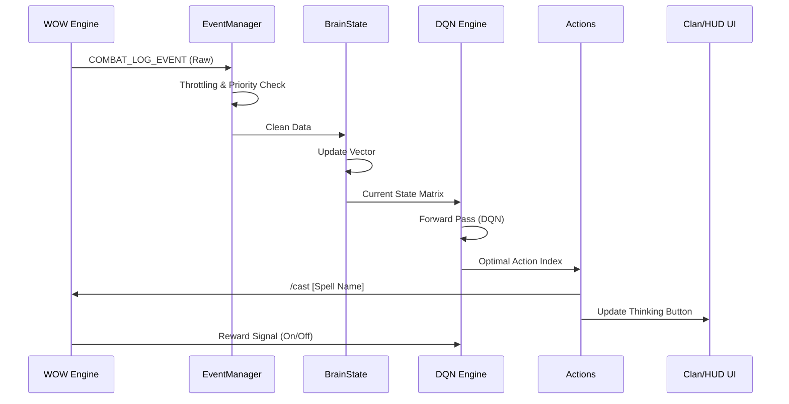

# Arquitectura de WCS_Brain v9.3.1

## Diagrama de Módulos

```mermaid
graph TD
    CORE["🧠 WCS_Brain Core (Hub Central)"]
    EVENTS["WCS_EventManager"]
    HELPERS["WCS_Helpers (Lua 5.0 Compat)"]
    RESOURCES["WCS_ResourceManager"]
    
    AI["🤖 Sistemas de IA"]
    DQN["WCS_BrainDQN (Deep Q-Network)"]
    ML["WCS_BrainML (Machine Learning)"]
    STATE["WCS_BrainState"]
    REWARD["WCS_BrainReward"]
    ACTIONS["WCS_BrainActions"]

    PET["🐺 IA de Mascotas"]
    PETAI["WCS_BrainPetAI"]
    GUARDIAN["WCS_GuardianV2"]
    EMOTIONS["WCS_BrainPetEmotions"]
    LEARNING["WCS_BrainPetLearning"]

    UI["🖥️ Interfaz de Usuario"]
    CLAN["WCS_ClanPanel (14 pestañas)"]
    HUD["WCS_BrainHUD"]
    BAR["WCS_BrainButtonBar"]
    THINKING["WCS_BrainThinkingUI"]

    INTEGRATION["🔗 Integraciones"]
    TERROR["TerrorMeter Bridge"]
    PROFILES["WCS_BrainProfiles"]
    BANK["WCS_ClanBank"]
    PVP["WCS_PvPTracker"]

    CORE --> EVENTS
    CORE --> HELPERS
    CORE --> RESOURCES
    CORE --> AI
    CORE --> PET
    CORE --> UI
    CORE --> INTEGRATION

    AI --> DQN
    AI --> ML
    AI --> STATE
    AI --> REWARD
    AI --> ACTIONS

    PET --> PETAI
    PET --> GUARDIAN
    PET --> EMOTIONS
    PET --> LEARNING

    UI --> CLAN
    UI --> HUD
    UI --> BAR
    UI --> THINKING

    INTEGRATION --> TERROR
    INTEGRATION --> PROFILES
    INTEGRATION --> BANK
    INTEGRATION --> PVP
```

## Capas del Sistema

### Capa 1: Núcleo (Core)
- **WCS_Helpers.lua**: Funciones de compatibilidad Lua 5.0 (Strict).
- **WCS_EventManager.lua**: Gestor centralizado de eventos con throttling y prioridad.
- **WCS_ResourceManager.lua**: Pool de recursos y gestión de memoria dinámica.
- **WCS_BrainCore.lua**: Inicialización, orquestación y ciclo de vida.

### Capa 2: Inteligencia Artificial (DQN Engine)
- **WCS_BrainDQN.lua**: Red neuronal profunda para toma de decisiones tácticas.
- **WCS_BrainML.lua**: Normalización de datos y extracción de características.
- **WCS_BrainState.lua**: Vector de estado (HP, Mana, Shards, Debuffs).
- **WCS_BrainReward.lua**: Función de recompensa (Efectividad/Tiempo).
- **WCS_BrainActions.lua**: Mapeo de decisiones a hechizos y acciones.

### Capa 3: IA de Mascotas (Pet Intelligence)
- **WCS_BrainPetAI.lua**: Motor de comportamiento adaptativo para demonios.
- **WCS_GuardianV2.lua**: Lógica de protección activa y control de CC.
- **WCS_BrainPetEmotions.lua**: Capa de simulación afectiva y estados de ánimo.

### Capa 4: Interfaz de Usuario (UI/UX)
- **WCS_ClanPanel.lua**: Framework de pestañas (14 módulos integrados).
- **WCS_BrainHUD.lua**: Visualización táctica de recursos vitales.
- **WCS_BrainButtonBar.lua**: Micro-barra de acciones contextuales.

### Capa 5: Ecosistema (Integrations)
- **WCS_BrainTerrorMeter.lua**: Enlace bidireccional de métricas con TerrorMeter.
- **WCS_BrainIntegrations.lua**: API Gateway para addons del ecosistema.

## Flujo de Datos en Combate (SFC)

